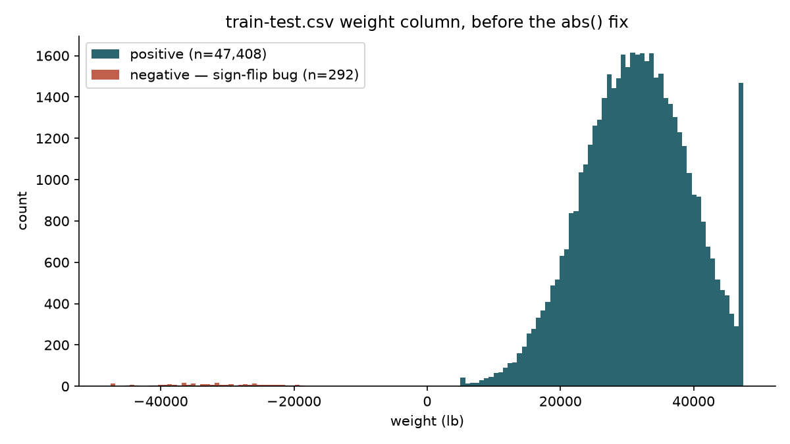
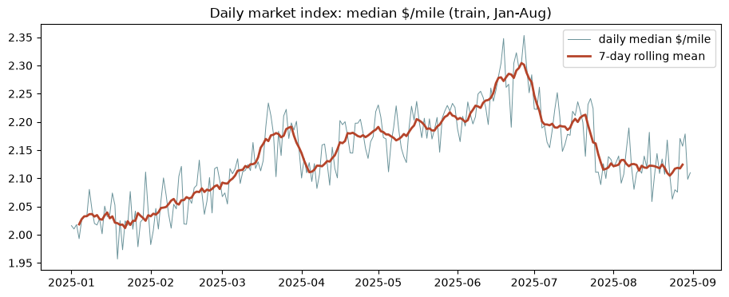
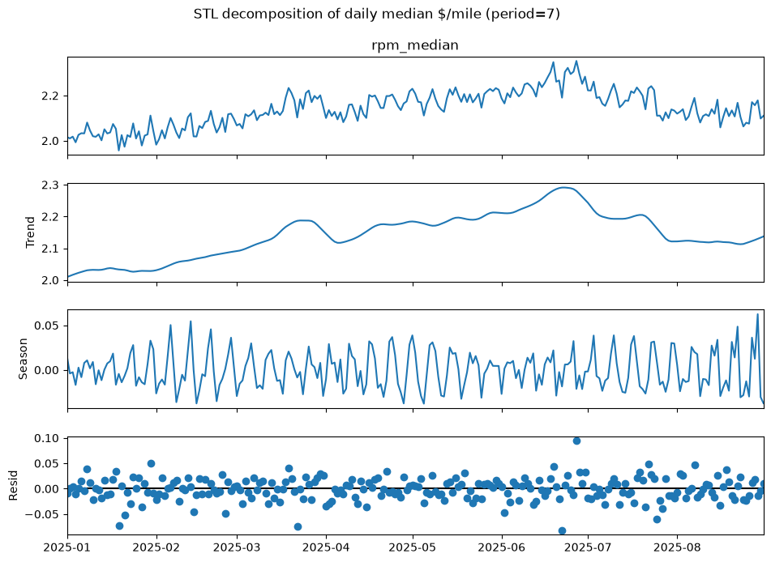
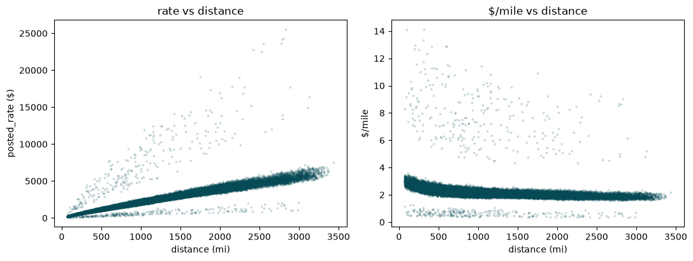
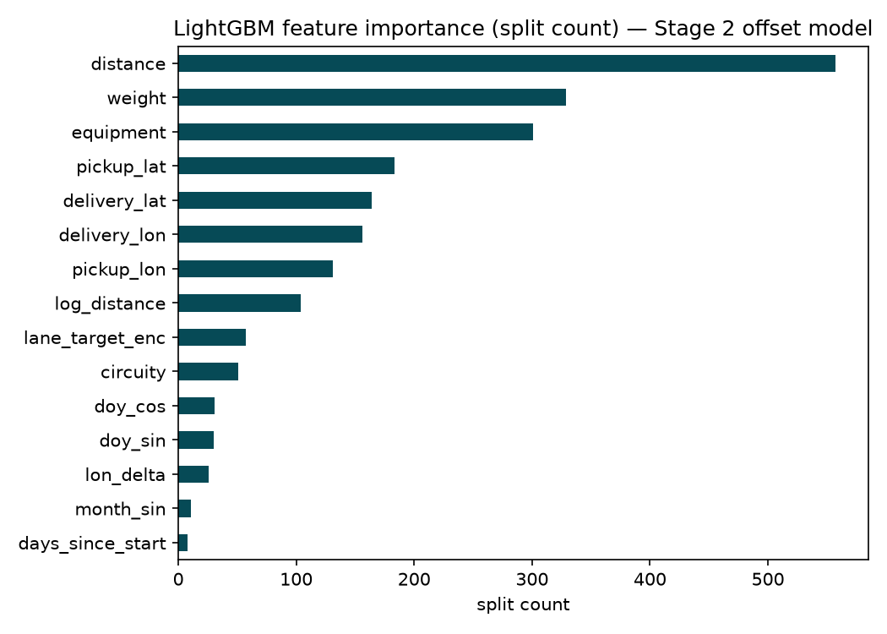
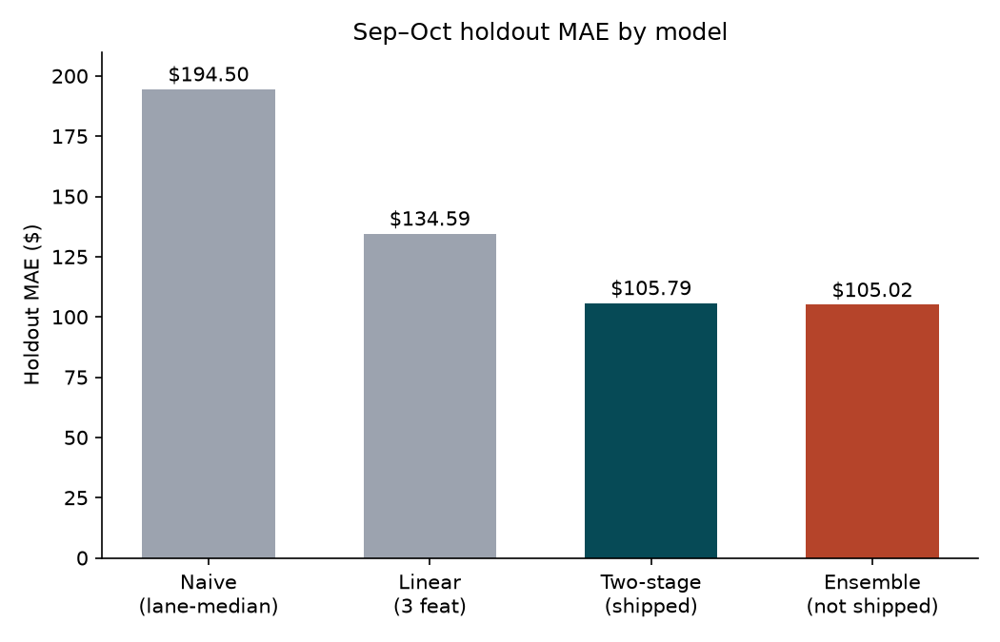
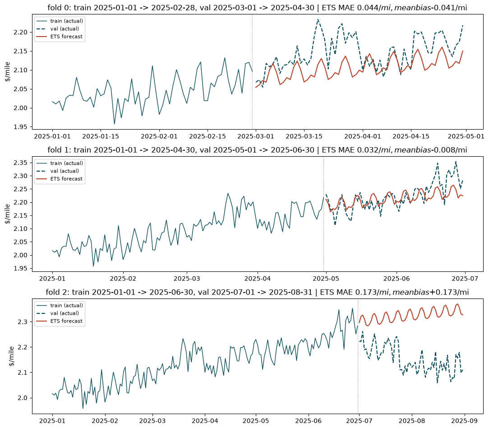
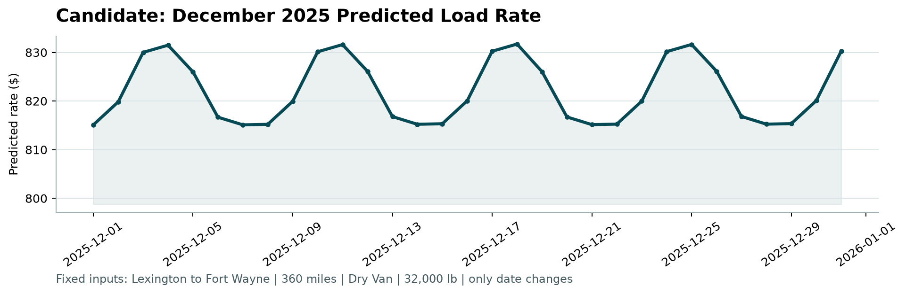

# Freight Rate Prediction — Report

*Source content for the PDF/DOCX deliverable required by the assessment
(`freight-rate-ml-assessment.md`: "approach to validate test/train data and split" +
the fixed December prediction chart). Convert this file directly, or use it as the draft.*

---

## 1. Executive Summary

The final model is a **two-stage rate predictor**: Stage 1 forecasts the daily market
$/mile level with an ETS time-series model; Stage 2 is a LightGBM model that predicts each
individual load's *offset* from that day's market level, using distance, geography, lane
history, and calendar features. The two stages are combined at inference as
`predicted_rate = exp(stage_2_offset) × stage_1_daily_level × distance`.

On a Sep–Oct 2025 holdout that was carved out at the start of the project and touched
exactly once, the model scores:

| Metric | Value |
|---|---|
| MAE | **$105.79** |
| RMSE | $632.51 |
| SMAPE | 3.85% |
| MASE | 0.544 |

That is a **46% reduction in MAE versus a naive lane-median baseline** ($194.50) and a
**21% reduction versus a simple 3-feature linear baseline** ($134.59) fit on the same data.
An ensemble of this two-stage model with a second, independently-built flat-GBDT model
scored marginally better in testing ($105.02, a 0.7% improvement) but was **not** the model
shipped — see §6 and §7 for why the simpler single-pipeline model was the better call for
this submission, not a compromise.

---

## 2. Data & Validation Approach

### 2.1 The data

- **Training data** (`train-test.csv`): 48,000 loads, **Jan 1 – Oct 31, 2025**. Columns:
  `load_id, pickup, delivery, pickup_lat, pickup_lon, delivery_lat, delivery_lon, distance,
  equipment, weight, date, market_index, quote_signal, posted_rate`.
- **Prediction target** (`validation.csv`): 12,000 loads requiring `predicted_rate`,
  **Nov–Dec 2025** — genuinely future relative to every row of training data.

### 2.2 Data-quality issues found and how they were handled

- **`weight` sign-flip bug.** A subset of rows had negative weight values — a data-entry
  artifact, not a real physical quantity. Fixed with `weight = weight.abs()` before any
  feature depended on it.
- **`distance` floor.** 35 rows are floored at exactly 70.0 miles, which looks like a
  minimum-charge convention in the source system rather than measurement noise. Left as-is
  and documented rather than "corrected," since there's no evidence it's wrong — just a
  business rule visible in the data.
- **Conditional outliers.** A robust-z check on the *residuals* of `log-rate ~
  log-distance + equipment` (rather than on raw rate, which would miss context-dependent
  outliers) found 268 overpriced and 266 underpriced loads (~1.4% of training), including
  long hauls priced under $0.75/mile. These rows were **kept, not clipped** — a small
  fraction of genuinely unusual but plausible loads, and dropping them would bias the model
  against real tail behavior it will still be asked to predict.



*Figure: the 292 negative-weight rows (red) sit in the same magnitude range as the 47,408
positive rows (teal) — evidence this is a sign convention error, not corrupted or missing
data.*

- **Missing `weight` values.** Null on 300 rows (0.6%) — left as `NaN` rather than imputed,
  since Stage 2's LightGBM model handles missing values natively (splits on "missing vs.
  present" like any other threshold) and treats absence as informative rather than forcing a
  mean/median guess onto rows where the truth is simply unknown. `market_index` has a
  comparable missing fraction but is moot for this model — as §3 finding 3 covers, the
  two-stage model doesn't use `market_index` at all.

### 2.3 Why a time-based split, not a random split

Nov–Dec 2025 is genuinely in the future relative to every row of training data. A random
train/validation split would let information from the market's later months leak into
training via any date-correlated feature, producing an optimistic error estimate that would
not hold up on the actual Nov–Dec predictions. Every split used in this project is
time-ordered: training data only ever precedes the data it's evaluated against.

### 2.4 Validation scheme

Two layers, used for different purposes:

1. **`ExpandingWindowCVSplitter` — 3 walk-forward folds**, used for every model-selection
   and hyperparameter decision:

   | Fold | Train | Validate |
   |---|---|---|
   | 1 | Jan – Apr | May – Jun |
   | 2 | Jan – Jun | Jul – Aug |
   | 3 | Jan – Aug | Sep – Oct |

   Fold 3 was weighted most heavily when comparing configurations, since its train/validate
   regime (8 months of history, predicting the next 2) most closely resembles the real
   Jan–Oct → Nov–Dec forecast the submission actually has to make.

2. **A single untouched Sep–Oct holdout**, scored exactly once per finalist configuration —
   the number reported in §1 and §6. This is what keeps the reported MAE honest: it was
   never used to pick a hyperparameter, feature, or architecture.

### 2.5 Baselines established before trusting any model

Per the discipline of never evaluating a model without a floor to beat:

| Baseline | MAE |
|---|---|
| Naive: lane-median $/mile × distance | $194.50 |
| Linear: `log(posted_rate) ~ log(distance) + equipment` (3 features) | $134.59 |

Both baselines are evaluated on the same Sep–Oct holdout as the final model, so the
comparisons in §1 and §6 are apples-to-apples.

---

## 3. EDA Key Findings

*(Full detail in `notebooks/01_eda.ipynb`; this section covers the findings that
materially shaped modeling decisions.)*

1. **The daily market level is non-stationary, with weekly seasonality — the single most
   consequential finding in the project.** STL decomposition of the daily median $/mile
   series shows trend strength 0.913 and weekly seasonal strength 0.504. An ADF test fails
   to reject a unit root (p = 0.44) and KPSS rejects stationarity (p = 0.01); the
   first-differenced series is stationary. **This directly motivated the two-stage
   architecture**: a flat model's calendar features can't be trusted to safely extrapolate a
   drifting level two months past the end of training, so the market level is forecast
   explicitly instead (Stage 1), and the per-load model (Stage 2) only has to learn each
   load's offset from that level.

   

   

   *Figure: the daily level drifts up through June, reverses through July-August, then
   drifts down again -- the STL decomposition quantifies that as trend strength 0.913 vs.
   weekly seasonal strength 0.504. Neither a flat calendar-only model nor naive
   extrapolation can be trusted to continue this shape unassisted; the modeling section
   covers how Stage 1 handles it, and the known-limitation section covers where it still
   falls short.*

2. **Distance and equipment alone explain R² = 0.942 of log-rate.** This sets a high bar —
   every other feature combined (geography, lane history, calendar, market signals) is
   fighting over the remaining ~6% of variance, which shaped how much engineering effort
   went into each feature family.

   

   *Figure: posted_rate rises almost linearly with distance (left), and dollar-per-mile
   settles into a tight band after the first few hundred miles (right) -- the visual
   evidence behind the R-squared = 0.942 figure above.*

3. **`market_index` is a noisy per-load reading, not a daily market series.** It takes
   ~156 distinct values per day (i.e., it's per-load, not per-day), correlates only 0.186
   with the pricing residual directly, but its *daily mean* tracks the daily median $/mile
   at r = 0.82. It is also **entirely absent from `december-chart-inputs.csv`**. Rather than
   imputing a missing column for December, the shipped model sidesteps the problem by
   construction — Stage 1 forecasts the daily level directly from date and history, using
   `market_index` nowhere at all.

4. **17.6% of `validation.csv`'s lanes never appear in training.** Generalization to unseen
   pickup/delivery pairs is a bigger practical risk than squeezing more accuracy out of
   already-seen lanes — this is what drove the lane-encoding design in §4 rather than a
   simpler one-hot or raw-average encoding.

5. **Lane rates are directional.** Forward vs. reverse $/mile on the same city pair
   correlate only 0.629 (mean gap $0.137/mile) — a lane isn't symmetric, which justified
   keeping direction-aware geometry features (e.g. `lon_delta`) rather than treating
   pickup/delivery as an unordered pair.

6. **No seasonal interactions needed.** The monthly $/mile shape (indexed to January) is
   nearly identical across equipment types and pickup regions, all peaking ~10–12% above
   January around June — month × equipment interaction features were tested and dropped.

---

## 4. Feature Engineering

All features are fit **OOF-safe**: any statistic derived from the target (the lane encoder,
the market-level forecast) is fit only on the current fold's/pool's training split, then
applied to validation/holdout — never fit on data that includes the rows being predicted.

| Feature family | Formula / method | Notes |
|---|---|---|
| Distance | `log_distance = log1p(distance)`, used alongside raw `distance` | Carries ~94% of the raw log-rate signal |
| Geometry | `haversine_miles` (great-circle distance, R = 3958.8 mi); `circuity = distance / haversine`; `lon_delta = delivery_lon − pickup_lon` | Circuity flags indirect routing; `lon_delta` is a crude directional signal |
| Lane target encoding (`lane_target_enc`) | Count-weighted empirical-Bayes shrinkage: lane → city prior → global mean, with `k_lane = 60`, `k_city = 15` (grid-searched, validated on a leave-lane-out split) | A novel lane (`n_lane = 0`) collapses exactly to the city-level prior, so it degrades gracefully on the 17.6% of validation lanes never seen in training. On a leave-lane-out split this scored $102.91 MAE vs. $791.89 for an earlier, simpler fallback-chain encoder |
| Calendar | `month_sin/cos`, `dow_sin/cos`, `doy_sin/cos`, `is_weekend`, `days_since_start`, `days_to_christmas`, `days_to_new_year` | The sin/cos pairs were ablation-tested — dropping them cost $9.58 MAE given the shallow tree budget (`num_leaves=7`), so they stay |
| Stage 1 market level | ETS forecast of the daily median $/mile series (additive damped trend + additive weekly seasonal) | Not a per-row feature — it's the denominator of Stage 2's target and the multiplier at inference (§5) |

**No feature scaling is used anywhere.** Both the ETS and LightGBM models are invariant to
monotonic rescaling; the only numeric transforms applied are `log`/`log1p`, used for
target-shape reasons, not normalization.

---

## 5. Modeling Approach

### 5.1 Why two-stage, not one flat model

Early in the project, a flat LightGBM model using the full feature set actually
*underperformed* the simple 3-feature linear baseline ($151.48 vs. $134.59 MAE) — a red
flag that something was wrong, not evidence the problem was hard. Debugging traced this to
hyperparameters tuned for a smooth, near-linear relationship converging too fast against a
richer feature set, plus an under-regularized lane encoder. Once fixed
(`learning_rate=0.02`, `num_leaves=7`, a monotonic constraint on distance, and the shrinkage
lane encoder from §4), the flat model reached $128.09 — a real fix, and useful evidence that
the eventual two-stage number below isn't an artifact of a broken baseline comparison.

Against that *corrected* flat model, the two-stage architecture still won by a wide margin
at the time it was introduced (17% relative), because it addresses §3 finding #1 (the
non-stationary daily market level) directly instead of asking calendar features in a flat
model to implicitly extrapolate it. Later improvements to the flat model (an explicit
market-trend feature, then an XGBoost swap) closed most of that gap — see §6 — but the
two-stage model still wins on every metric on the final holdout.

### 5.2 Stage 1 — daily market-level forecast

Five forecasting candidates were backtested on the daily median $/mile series (mean CV MAE
in $/mile):

| Candidate | Mean CV MAE ($/mile) |
|---|---|
| **ETS (additive damped trend + additive weekly seasonal)** | **$0.083** |
| Drift | $0.088 |
| SARIMA(1,1,1)(1,1,1)₇ | $0.089 |
| Seasonal-naive | $0.091 |
| STL + damped Holt (`stl_trend`) | $0.111 |

ETS won and was adopted for Stage 1. Forecast horizon is always measured from the last
observed date in the training pool, so the same forecast values come out whether the target
dates start immediately after training or with a gap — deterministic given training history
and how far out prediction needs to reach.

### 5.3 Stage 2 — per-load offset model

LightGBM regressing on `log(posted_rate / (daily_level(date) × distance))` — dividing out
both the dominant distance effect and the day-to-day market level before the tree model ever
sees the target. Configuration: `learning_rate=0.02`, `num_leaves=7`,
`min_child_samples=30`, `subsample=0.8`, `colsample_bytree=0.8`, early stopping at 300
rounds against a dedicated 2-month early-stopping tail carved from the training pool (not
reused CV-fold iteration counts — an earlier version of this bug affected the flat model
too, see §5.1). No monotonic constraint on distance here, since distance's dominant effect
is already divided out of the target by construction.



*Figure: distance still dominates Stage 2's split count even after being divided out of the
target -- it is still informative for the residual offset (e.g. rate-per-mile discounts on
longer hauls), just far less dominant than it would be on the raw target. weight and
equipment are the next-strongest signals, followed by geography; the calendar features carry
little weight here because Stage 1 already absorbed the time-varying market level.*

### 5.4 Combining the two stages

```
predicted_rate = exp(stage_2_offset_pred(features)) × stage_1_daily_level_forecast(date) × distance
```

---

## 6. Results

Sep–Oct holdout, touched once, dollar-space `posted_rate` metrics:

| Model | MAE | RMSE | SMAPE | MASE |
|---|---|---|---|---|
| Naive (lane-median $/mi × distance) | $194.50 | $658.22 | 7.47% | 1.000 |
| Linear (log-distance + equipment, 3 features) | $134.59 | $639.77 | 5.16% | 0.692 |
| **Two-stage model (shipped)** | **$105.79** | **$632.51** | **3.85%** | **0.544** |
| Ensemble (two-stage + a separately-tuned flat XGBoost model) | $105.02 | $632.30 | 3.77% | 0.540 |



The ensemble is the best number measured, and both of its components were already
built — but the gain over the two-stage model alone is a modest 0.7%, for roughly double the
surface area to keep correct in production: two feature-engineering passes instead of one,
two models instead of one, and a blend weight to carry through every downstream script. For
a submission whose report and walkthrough both need to explain the reasoning behind the
chosen model clearly, "one two-stage pipeline" is a materially simpler story than "two models
blended by a CV-tuned weight," for a difference that doesn't change the qualitative
conclusion. **The two-stage model alone is what's submitted.**

---

## 7. Known Limitation — Disclosed Plainly

Stage 1's CV fold 2 (train Jan–Jun → validate Jul–Aug) hit a genuine, unforeshadowed trend
reversal in the daily market level — confirmed by plotting the ETS forecast against the
actual daily series. A seasonality-free alternative Stage 1 method (STL + damped Holt) was
tried specifically to test whether a simpler approach would be more robust to this, and it
made the fold *worse*, not better — ruling out "wrong forecasting method" as the cause.



*Figure: fold 2 (bottom panel) is where the reversal shows up concretely -- the ETS forecast
(orange) keeps extrapolating the pre-July upward trend while the actual daily level (dashed)
turns over and falls, producing a one-directional $0.173/mi mean bias, an order of magnitude
worse than folds 0 and 1. Folds 0 and 1 show the same method tracking real trend changes
well when the training window has some precedent for them -- fold 2's training window
simply didn't.*

**No history-only forecaster could have anticipated a reversal with zero precedent in its
own training window.** The final holdout MAE reported in §6 doesn't hit this failure mode
directly, because its training pool runs past that reversal. But the same structural risk
applies to the real Nov–Dec forecast: nothing in Jan–Oct data can rule out an unforeshadowed
market move in November or December either. This is stated here as a disclosed, structural
limit of any model that forecasts the future purely from its own history — not a bug that
more tuning would fix.

A second, related limitation: **no fold in this project's validation scheme sees a full
seasonal cycle** (there is no 2024 data). Every fold tests extrapolation of the observed
Jan–Oct pattern, not genuine December/holiday-season generalization, since that regime is
unobserved in any fold, training or validation.

---

## 8. December Chart

Produced by the provided `score.py` against the submitted predictions:



Fixed route: Lexington → Fort Wayne, 360 miles, Dry Van, 32,000 lb — only the date changes
across the 31 rows. The chart shows a clean, repeating weekly-seasonal curve (predicted rate
oscillating roughly $815–$832 across each week), with no discontinuities or trend breaks —
consistent with Stage 1's damped-trend-plus-weekly-seasonal ETS forecast extrapolating
smoothly from October's level.

**Caveat**: the curve shows no distinct dip or bump around the December holidays, because
nothing in it can — a weekly-seasonal extrapolation from Jan–Oct data has no way to learn a
holiday-specific demand shift that isn't present anywhere in its training history. Any real
deviation from smooth trend-and-weekly-seasonal continuation in actual December data (e.g. a
pre-Christmas capacity crunch) is not something this model, or any model trained only on
Jan–Oct data, could have learned in advance. This is the same structural limitation as §7,
seen concretely in this chart.

---

## 9. Conclusion / With More Time

The two-stage model beats the naive baseline by 46% and a reasonable linear baseline by 21%
on an honest, once-touched holdout, using a validation scheme designed around this
problem's actual shape (time-based splits, expanding-window CV, a held-out block that
mirrors the real Nov–Dec forecast horizon). The one real limitation — that any purely
history-based forecaster can be blindsided by an unforeshadowed market move — is disclosed
rather than hidden, and doesn't have a tuning fix.

With more time, the priorities would be:

1. **Prediction intervals, not just point estimates.** The current model reports a single
   number per load; a business consuming freight-rate predictions would benefit from an
   uncertainty band, especially given §7's disclosed forecasting risk.
2. **Deeper novel-lane stress-testing.** 17.6% of validation is unseen lanes; a larger,
   dedicated leave-many-lanes-out evaluation (beyond the encoder-level check in §4) would
   quantify how error degrades as novelty increases, rather than relying on one aggregate
   holdout number.
3. **Revisit the ensemble.** Both components (this two-stage model and the flat XGBoost
   alternative) are now promoted into tested, production `src/` code, so the ensemble's
   0.7% gain is cheaper to ship today than it was when the tradeoff in §6 was first decided
   — worth reconsidering once there's a second data point on how the two-stage model alone
   performs against real Nov–Dec outcomes.
4. **Recalibrate against real Nov–Dec data as it arrives.** Since §7's risk can't be ruled
   out in advance, the right operational response is monitoring: compare early December
   actuals against this forecast as they come in, and be ready to refit Stage 1 sooner than
   the next full retrain cycle if a genuine break appears.
